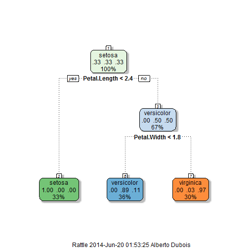

## Introduction to the project
In this project we are going to predict the species of a flower with its Sepal and Petal characteristics. Our model will consist of a classification tree trained with the data available in RStudio. 

I have chosen to build a classification tree due to its interpretability. It might not be the best model but it has a better user interface because it allows the users to see how he has to play with the sliders in a more straightforward way.

This presentation is structured as:

1. Data Analysis
2. Interpretation of the results
3. Usability

--- #bg:yellow

## Data analysis

First of all we need to load the "iris" package from RStudio. We have 150 observations of different flowers with only three species: setosa, versicolor and virginica.
We can assume that all variables are significant so we will use all of the data to fit the model. The steps are the following:

1. Load the data
2. Split the data into train and test. We want to avoid overfitting. Testing I saw that if I use all the data for training the classification tree predicts the species as the baselines, so it doesn't add any value to the app.
3. Build the Classification tree
4. Create the test dataframe
5. Predict the species
6. Plot the classification tree


--- bg:yellow

## Data analysis cont.
This is the code runned:


```r
#Load the data
data=iris

# Randomly split the data into training and testing sets
set.seed(1000)
split = sample.split(data$Species, SplitRatio = 0.65)

# Split up the data using subset
train = subset(data, split==TRUE)
test = subset(data, split==FALSE)

# Regression Tree
model = rpart(Species ~ ., method="class", data = train)

#Create test dataframe
test = data.frame(Sepal.Length=2,Sepal.Width=2,Petal.Length=2,Petal.Width=2)

#Predict
prediction = predict(model, newdata = test, type = "class")
prediction
```

```
##      1 
## setosa 
## Levels: setosa versicolor virginica
```

--- bg:lightgrey

## Interpreting results
The Classification Tree obtained is:

```r
fancyRpartPlot(model)
```

 

As we can see, the two significant variables determined by the algortihm are Petal.Length and Petal.Width. The user can check this by changing the slider of the other two variables and seeing that the prediction does not change. This model is very simple and can be improved by cross-validation, using random forests, etc.

---

## Usability
The user can change the charcteristics of the flower through the sliders at the top left corner. The min and max value of each slider is obtained from the original data, so we dont make any extrapolation.

The value predicted is shown under "Prediction of the species" and the flower selected by the user under the field "Value of the parameters". Finally, so the user understands how the model works it is shown the classification tree. This model doesnt depend on the flower selected by the user, so it is fixed.

It is then a very user friendly shiny app and can be useful for flower lovers or students who want to check how a classification tree works.
